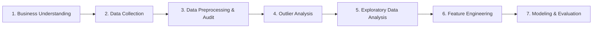

<p align="center">
  <h1 align="center">⌚ Smartwatch Price Prediction & Market Analysis</h1>
  <p align="center">
    <em>An end-to-end data science and machine learning project analyzing smartwatch specifications, market signals, and pricing dynamics.</em>
  </p>
  <p align="center">
    <a href="#-problem-statement">Problem Statement</a> •
    <a href="#-dataset-overview">Dataset</a> •
    <a href="#-methodology--workflow">Methodology</a> •
    <a href="#-exploratory-data-analysis--key-insights">EDA & Insights</a> •
    <a href="#-tech-stack">Tech Stack</a> •
    <a href="#-getting-started">Getting Started</a> •
    <a href="#-roadmap">Roadmap</a>
  </p>
</p>

---

## 📌 Problem Statement

The smartwatch market encompasses a vast spectrum of devices—ranging from budget fitness trackers priced under ₹1,200 to premium smartwatches exceeding ₹1,39,000. With diverse brands, feature sets, and aggressive e-commerce discounting, understanding the true determinants of smartwatch pricing is vital for both consumers and manufacturers.

**Core Objectives:**
1. **Understand Pricing Drivers:** Uncover how hardware specifications (display size, battery life, weight, touchscreen, Bluetooth) and brand positioning influence product pricing and discounts.
2. **Predict Selling Price:** Prepare data and train regression models to accurately forecast the `Current Price` of smartwatches based on technical attributes and market signals.

---

## 📊 Dataset Overview

| Attribute | Details |
|---|---|
| **Dataset File** | `smartwatches.csv` |
| **Total Records** | 450 smartwatches (raw) |
| **Feature Count** | 15 columns |
| **Unique Brands** | 18 brands |
| **Target Variable** | `Current Price` (₹ INR) |

### Feature Dictionary

| Feature | Data Type | Description |
|---|---|---|
| `Brand` | Categorical | Brand manufacturer (e.g., Apple, Samsung, Garmin, BoAt, Noise) |
| `Model Name` | Categorical | Specific model name / series identifier |
| `Current Price` | Numerical | Current discounted selling price (₹) |
| `Original Price` | Numerical | Maximum Retail Price (MRP) (₹) |
| `Discount Percentage` | Numerical | Applied discount rate (%) |
| `Rating` | Numerical | User average rating (1.0 to 5.0 scale) |
| `Number OF Ratings` | Numerical | Total number of consumer reviews |
| `Dial Shape` | Categorical | Shape of the watch face (Circle, Square, Rectangle, Oval, etc.) |
| `Strap Color` | Categorical | Color of the watch strap |
| `Strap Material` | Categorical | Strap build material (Silicon, Leather, Metal, Stainless Steel, etc.) |
| `Touchscreen` | Categorical / Binary | Touchscreen capability (`Yes` / `No` → Encoded as `1` / `0`) |
| `Bluetooth` | Categorical / Binary | Bluetooth connectivity (`Yes` / `No` → Encoded as `1` / `0`) |
| `Display Size` | Numerical | Screen diagonal size in inches (parsed from text) |
| `Battery Life (Days)` | Numerical | Expected operational battery life per charge |
| `Weight` | Categorical | Weight category class (`35 - 50 g`, `50 - 75 g`, `> 75 g`, etc.) |

### Brands Represented

```
amazfit • ambrane • apple • boat • crossbeats • dizo • fire-boltt • fitbit
fossil • garmin • gizmore • hammer • honor • huawei • noise • pebble • samsung • zebronics
```

---

## 🔬 Methodology & Workflow

This project follows the **CRISP-DM** (Cross-Industry Standard Process for Data Mining) framework:



### 1. 🧠 Problem Understanding
- Defined regression target: `Current Price`.
- Formulated key analytical questions regarding brand equity, hardware tradeoffs (battery vs. touchscreen/display), and discounting behavior.

### 2. 📥 Data Ingestion
- Loaded raw dataset (`smartwatches.csv`) with index alignment and dimension validation.

### 3. 🧹 Data Cleaning & Preprocessing
- **Data Type Corrections:** Extracted clean numerical floats from `Display Size` by stripping the `"inches"` unit string.
- **Brand-Aware Imputation:**
  - Categorical columns imputed using the **mode** grouped by `Brand`.
  - Numerical columns imputed using the **median** grouped by `Brand`.
  - Preserves brand-specific distributions rather than distorting with global aggregates.
- **Deduplication:** Audited and removed duplicate records, followed by index resetting.
- **Data Auditing Utilities:** Implemented custom diagnostic functions:
  - `check(data)`: Comprehensive audit of data types, valid instances, nulls, unique count, and duplicates.
  - `check_unique(data)`: Quick inspection of unique counts and sample unique values across all attributes.

### 4. 📈 Outlier Detection & Handling
- **IQR (Interquartile Range) Method:** Computed bounds ($Q_1 - 1.5 \times \text{IQR}$ to $Q_3 + 1.5 \times \text{IQR}$) across all numeric columns using `tabulate`.
- **Interactive Box Plots:** Visualized multi-feature distributions with Plotly Express to identify high-end luxury outliers (`Apple`, `Garmin`) and display anomalies.

### 5. 🔍 Exploratory Data Analysis (EDA)
- Extensively investigated relationships between brand tiers, prices, battery life, display sizes, ratings, and feature sets (detailed below).

### 6. ⚙️ Feature Engineering & Preprocessing *(In Progress)*
- Binary feature encoding (`LabelEncoder` applied to `Touchscreen` and `Bluetooth`).
- Preparation of categorical encoders and feature scaling for downstream regression pipelines.

---

## 💡 Exploratory Data Analysis & Key Insights

### 1. Pricing Dynamics & Brand Positioning
- **Right-Skewed Distribution:** The majority of smartwatch sales concentrate in the budget segment (₹1,200 – ₹6,000), while luxury and specialized outdoor brands (Apple, Garmin, Fossil) create a long right tail with prices exceeding ₹80,000 to ₹1,39,000.
- **Original Price vs. Discount Inversion:** High-MRP premium watches exhibit significantly lower discount percentages (or fixed pricing), whereas budget brands rely heavily on steep discounts (often 50%–80%) as a primary marketing mechanism.
- **Price Correlation:** Strong positive linear relationship ($r > 0.8$) between `Original Price` and `Current Price`.

### 2. Same-Model Price Discrepancies
- Grouping by `(Brand, Model Name, Display Size, Weight)` revealed variants of identical models with differing selling prices.
- Discrepancies stem from:
  1. Strap material/color and dial shape variations.
  2. Distinct promotional discounts across different SKUs.

### 3. Battery Life Trade-offs
- **Touchscreen Impact:** Smartwatches **without** touchscreens average significantly higher battery life (~20–25+ days) compared to touchscreen counterparts (~6–10 days).
- **Multivariate Aggregations:** Analyzed `Battery Life (Days)` across `(Touchscreen, Bluetooth, Display Size)` combinations, illustrating that smaller screen sizes without active touch digitizers achieve maximum longevity.

### 4. Weight vs. Pricing & Ratings
- Devices in heavier weight categories (`> 75 g` and `50 - 75 g`) are often metal/stainless-steel builds or rugged outdoor smartwatches, carrying higher average selling prices.
- Ratings remain consistently high across weight brackets (~4.0+), indicating broad consumer satisfaction across both lightweight bands and heavy premium watches.

### 5. Rating Consistency
- User ratings cluster tightly around a mean of **4.03 / 5.0** ($\sigma \approx 0.55$), showing consistent customer satisfaction irrespective of whether a watch includes Bluetooth calling or basic connectivity.

---

## 🛠️ Tech Stack

| Domain | Tools & Libraries |
|---|---|
| **Language** | Python 3.10+ |
| **Data Processing** | Pandas, NumPy |
| **Machine Learning & Preprocessing** | Scikit-Learn (`LabelEncoder`, etc.) |
| **Visualization** | Matplotlib, Seaborn, Plotly Express |
| **Data Auditing & Formatting** | Tabulate |
| **Environment** | Jupyter Notebook, Python `venv` |

---

## 🚀 Getting Started

### Prerequisites

Ensure you have Python 3.10 or higher installed.

```bash
python --version
```

### Installation

1. **Clone the repository:**
   ```bash
   git clone https://github.com/bhaveshsolanki159-codex/ML-mini-practice-Projects.git
   cd "ML-mini-practice-Projects/Watch Price Predictions"
   ```

2. **Create and activate a virtual environment:**
   ```bash
   # Create venv
   python -m venv venv

   # Activate on Windows (PowerShell / Command Prompt)
   .\venv\Scripts\activate

   # Activate on macOS / Linux
   source venv/bin/activate
   ```

3. **Install required dependencies:**
   ```bash
   pip install pandas numpy matplotlib seaborn plotly tabulate scikit-learn jupyter
   ```

4. **Launch the Notebook:**
   ```bash
   jupyter notebook main.ipynb
   ```

---

## 📁 Project Structure

```
Watch Price Predictions/
│
├── main.ipynb          # Jupyter notebook containing data cleaning, auditing, and EDA
├── smartwatches.csv    # Dataset with 450 smartwatch listings and 15 features
├── README.md           # Project documentation and findings
├── venv/               # Local virtual environment (ignored in git)
└── .gitignore          # Git ignore rules
```

---

## 🗺️ Roadmap

- [x] Problem formulation and business objective definition
- [x] Data collection and ingestion
- [x] Data cleaning (type casting, brand-wise mode/median imputation, deduplication)
- [x] Custom dataset auditing functions (`check`, `check_unique`)
- [x] Outlier detection via IQR and Plotly box plots
- [x] Exploratory Data Analysis (EDA)
  - [x] Price vs. discount correlation analysis
  - [x] Brand-wise price & model distribution
  - [x] Battery life vs. touchscreen / Bluetooth / display size analysis
  - [x] Intra-model price variation analysis
  - [x] Weight category vs. price and rating analysis
- [x] Feature encoding & preprocessing (`ColumnTransformer`, `OneHotEncoder`, `StandardScaler`, ordinal `Weight` mapping)
- [x] Target log-transformation (`TransformedTargetRegressor` with $\log(1+y)$)
- [x] Baseline & ensemble model benchmarking (Linear Regression, Ridge, Decision Tree, Random Forest, Gradient Boosting, AdaBoost)
- [x] Model evaluation (RMSE, MAE, $R^2$ Score) & Feature Importance Analysis
- [ ] Hyperparameter Tuning & Cross-Validation
- [ ] Advanced Boosting (XGBoost, LightGBM, CatBoost) & Ensembling / Stacking
- [ ] Deployment (Streamlit / Flask web app for live price estimation)

---

## 🤝 Contributing

Contributions, improvements, and feedback are always welcome!
1. Fork the repository
2. Create your feature branch (`git checkout -b feature/NewAnalysis`)
3. Commit your changes (`git commit -m 'Add new model evaluation'`)
4. Push to the branch (`git push origin feature/NewAnalysis`)
5. Open a Pull Request

---

## 📄 License

This project is licensed under the MIT License — feel free to use it for study and research purposes.

---

<p align="center">
  Crafted with passion by <a href="https://github.com/bhaveshsolanki159-codex">Bhavesh Solanki</a>
</p>